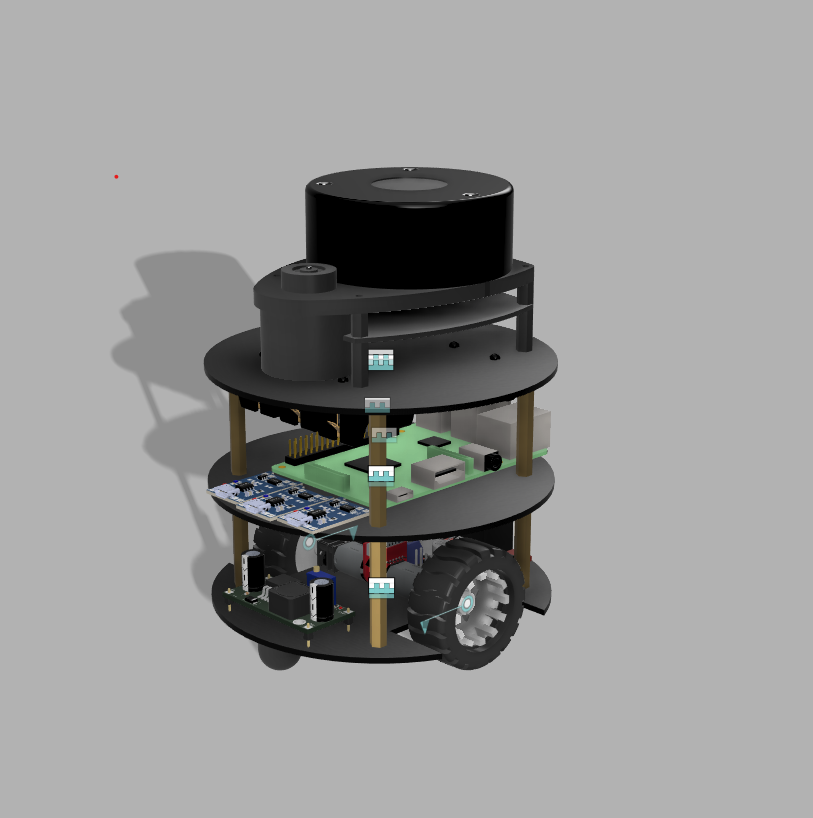

# Autonomous robot  
---
-   Design an autonomous robot in Fusion 360 from scratch.
-   Differential drive, laser (2d-Lidar), and camera plugins were implemented, and gazebo was used to simulate the 	results in a user-defined world.
---
### Images

### Videos
./img/assignment7(1).mp4
./img/assignment7(2).mp4
